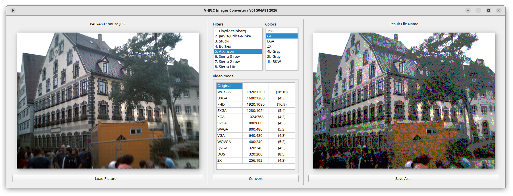

# VHPIC Images Converter

VHPIC Images Converter is a specialized desktop utility designed for transforming modern image files into **retro-compatible graphics assets**.  
Unlike generic image editors, this tool focuses on **low-color, low-resolution rendering pipelines** that were historically used in vintage computing, embedded systems, and early video hardware.  

By combining **classic dithering algorithms**, **color depth reduction**, and **retro video mode emulation**, the converter allows developers, hobbyists, and digital archivists to:
- Recreate the look and feel of classic platforms such as DOS, EGA, and ZX Spectrum.
- Prepare assets for constrained environments (FPGA projects, microcontrollers, or custom video mixers).
- Explore how different dithering strategies affect image quality under strict hardware limitations.
- Generate authentic retro visuals for demos, games, or technical case studies.

This makes the tool invaluable for:
- **Retro-coding enthusiasts** who want to integrate period-accurate graphics into their projects.
- **Hardware developers** needing test images for low-spec pipelines.
- **Educators and archivists** demonstrating the evolution of computer graphics.
- **Artists and designers** experimenting with nostalgic aesthetics.

## Features

**Dithering Algorithms:** Full support for classic error-diffusion filters:
  - Floyd-Steinberg — fast, widely used, smooth gradients but may show “worm-like” artifacts.
  - Jarvis-Judice-Ninke — distributes error across 12 neighbors, very smooth but computationally heavy.
  - Stucki — similar to Jarvis but optimized weights, often considered the highest quality diffusion.
  - Burkes — simplified Jarvis variant, faster with good balance of quality and speed.
  - Atkinson — classic Macintosh filter, preserves contrast, iconic retro look, less detail in gradients.
  - Sierra 3-row — high-quality, smooth gradients, slower due to wider error spread.
  - Sierra 2-row — faster compromise, good for real-time rendering.
  - Sierra Lite — minimal diffusion, very fast, suited for embedded systems but lower quality.

**Flexible Color Depth & Modes:**
  - 8-bit Indexed Color (256 colors)
  - 6-bit Indexed Color (64 colors)
  - 4-bit EGA 16-color palette
  - 4-bit ZX Spectrum palette (fixed 15+1 colors)
  - 4-bit Grayscale (16 levels / 4b Gray)
  - 2-bit Grayscale (4 levels / 2b Gray)
  - 1-bit Black & White (Monochrome / 1b B&W)

**Target Retro Video Modes:** Automatic aspect-ratio aware resizing or cropping for various display standards:
  - Modern/High-Res: `WUXGA` (1920x1200), `UXGA` (1600x1200), `FHD` (1920x1080)
  - Classic PC: `SXGA` (1280x1024), `XGA` (1024x768), `SVGA` (800x600), `VGA` (640x480)
  - Handheld & Widescreen: `WVGA` (800x480), `WQVGA` (400x240), `QVGA` (320x240)
  - Retro Systems: `DOS` (320x200, 8:5), `ZX` (256x192, 4:3)
  - `Original` mode to preserve source dimension ratio.

## Interface Overview

The interface is structured cleanly into three main layout sections:
1. **Source Panel (Left):** Load your input graphics (`.jpg`, `.png`, etc.) and view image specifications.
2. **Configuration Panel (Center):** Choose your preferred dithering filter, color count, and target display resolution/video mode.
3. **Result Panel (Right):** Preview the dithered low-color output before exporting the final image asset.

## Usage

1. Click **Load Picture...** to open an image file.
2. Select your desired dithering filter from the **Filters** list.
3. Select the target bit-depth from the **Colors** panel.
4. Pick the destination resolution standard from the **Video mode** table.
5. Click **Convert** to generate the low-spec retro preview.
6. Click **Save As...** to export your compiled asset into the destination container format.

## System Requirements

- Compatible with modern Windows/Linux environments running native window managers or desktop suites.
- Built-in optimizations for high-concurrency pixel mapping and color quantization pipelines.

## Related Tools

- [formats/cells](https://vigatron.github.io/formats/cells/) — Cell specification guidelines.
- [pushk2cellseditor](https://vigatron.github.io/pushk2cellseditor/) — High-performance grid and tile pipeline data tools.
- [viewvhpic](https://vigatron.github.io/viewvhpic/) — Native image viewer for compiled `.vhpic` graphics assets.

*© 2025–2026 Viktor Glebov (V01G04A81) — MIT License*
